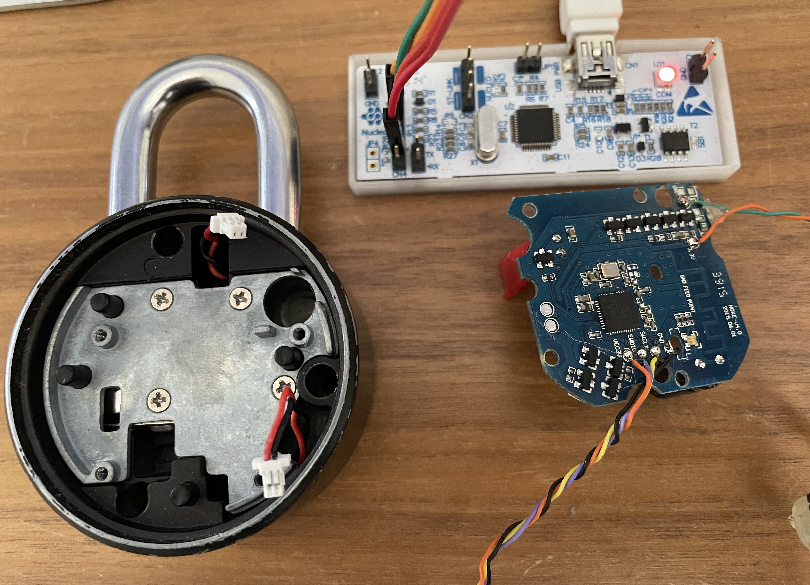
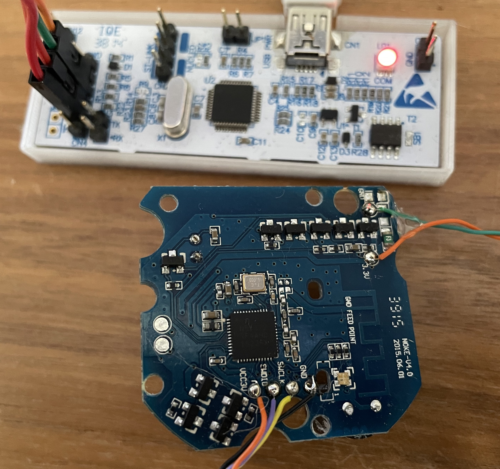

## Hacking the NOKE Bluetooth padlock - nrf51822 (ARM Cortex-M0)

### Description:

nrf51 - Readout Protection is basically broken.
Registers on the chip can be read and set, allowing us to load instructions into memory that will effectively read out any address of the onboard flash memory and in this way dumping the whole firmware.

We are a going to use a st-link debugger and openocd to connect to the swd (single wire debugger) port of the NOKE. Test pins are nicely labeled so here comes the soldering iron and some thin wire that will make the physical connection to the debugger much more convenient and durable.

$ openocd -f stlink.cfg -f nrf51.cfg
Open On-Chip Debugger 0.11.0
...
Info : STLINK V2J37M27 (API v2)
...
Info : nrf51.cpu: hardware has 4 breakpoints, 2 watchpoints
Info : accepting 'telnet' connection on tcp/4444

Then we connect to openocd via telnet:
$ telnet 127.0.0.1 4444

> reset halt

target halted due to debug-request, current mode: Thread 
xPSR: 0xc1000000 pc: 0x000006d0 msp: 0x000007c0

There we are connected to the locked CPU via swd protocol but as stated in Kris's article "RBPCONF" (short for readback protection) is enabled:
> mdw 0x10001004

0x10001004: ffff00ff

And therefore, blocking in principle any attempt to read out the flash content and its firmware without mass erasing the device.

But we can read the cpu registers and step the program counter... nice!

> reset halt

target halted due to debug-request, current mode: Thread 
xPSR: 0xc1000000 pc: 0x000006d0 msp: 0x000007c0
> reg

===== arm v7m registers
(0) r0 (/32): 0xffffffff
(1) r1 (/32): 0xffffffff
(2) r2 (/32): 0xffffffff
(3) r3 (/32): 0xffffffff
(4) r4 (/32): 0xffffffff
(5) r5 (/32): 0xffffffff
(6) r6 (/32): 0xffffffff
(7) r7 (/32): 0xffffffff
(8) r8 (/32): 0xffffffff
(9) r9 (/32): 0xffffffff
(10) r10 (/32): 0xffffffff
(11) r11 (/32): 0xffffffff
(12) r12 (/32): 0xffffffff
(13) sp (/32): 0x000007c0
(14) lr (/32): 0xffffffff
(15) pc (/32): 0x000006d0
(16) xPSR (/32): 0xc1000000
(17) msp (/32): 0x000007c0
(18) psp (/32): 0xfffffffc
(20) primask (/1): 0x00
(21) basepri (/8): 0x00
(22) faultmask (/1): 0x00
(23) control (/3): 0x00
===== Cortex-M DWT registers

Ok, not much to see here... let's keep on poking.

After the 2. step r4 changes, it's alive!
> step 

> reg

===== arm v7m registers
(0) r0 (/32): 0xffffffff
(1) r1 (/32): 0xffffffff
(2) r2 (/32): 0xffffffff
(3) r3 (/32): 0xffffffff
(4) r4 (/32): 0x00000c00

Ok, r4 has some value now, but 0x00000c00 doesn't look very special, maybe some start vector or initialisation value, but probably not memory content...

But then, after the 6. step:
> reg 

===== arm v7m registers
(0) r0 (/32): 0xffffffff
(1) r1 (/32): 0xffffffff
(2) r2 (/32): 0xffffffff
(3) r3 (/32): 0x10001014
(4) r4 (/32): 0xffffffff
(5) r5 (/32): 0xffffffff
(6) r6 (/32): 0xffffffff
(7) r7 (/32): 0xffffffff
(8) r8 (/32): 0xffffffff
(9) r9 (/32): 0xffffffff
(10) r10 (/32): 0xffffffff
(11) r11 (/32): 0xffffffff
(12) r12 (/32): 0xffffffff
(13) sp (/32): 0x000007c0
(14) lr (/32): 0xffffffff
(15) pc (/32): 0x000006dc
...

Bingo, we find a promising value in r3: 0x10001014. This value strongly suggest we are reading from memory. At this point pc register has a value of 0x000006dc which we will use it in Kris's script. 

Adapting Kris's script. We need to step into the previous instruction 
> step 0x000006da

And we are able to iterate through the whole memory, reading each and every value. 
That is from 0x00000000 to 0x00040000 in steps of 4 yielding a file with size 
0x10000 bytes = 65'536 bytes = 256 kB 
Success, we just obtained the firmware! 

No we can unlock the device by mass erasing it and and then reflashing the firmware onto it.
> nrf51 mass_erase
> 
> program erase nrf51.bin

And we check our RBCONF register to see that our chip was successfully unlocked.
> mdw 0x10001004

0x10001004: ffffffff

Nice!

### Reference:
#### Inspiration:
"How the Apple AirTags were hacked", https://www.youtube.com/watch?v=_E0PWQvW-14
"nRF52 Debug Resurrection", https://limitedresults.com/2020/06/nrf52-debug-resurrection-approtect-bypass/

#### Firmware dumping: 
"Firmware dumping technique for an ARM Cortex-M0 SoC", https://blog.includesecurity.com/2015/11/firmware-dumping-technique-for-an-arm-cortex-m0-soc/

#### Code:
https://github.com/geeksville/nrf51-extractor/blob/master/readout.py
